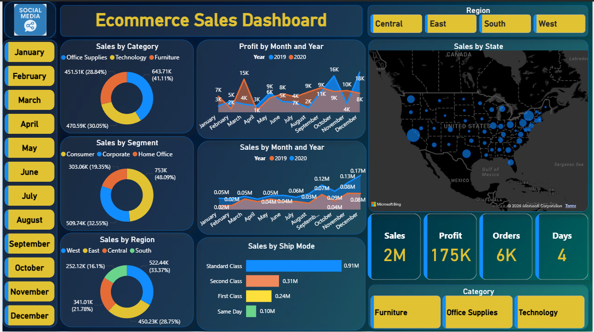

# Ecommerce-Sales-Analysis
# 📊 E-commerce Sales Dashboard (Power BI)

## 🔹 Project Overview

Developed an **interactive Power BI dashboard** to analyze two years of e-commerce sales data across the United States. The dashboard provides insights into sales performance, customer segments, product categories, and shipping efficiency.

---

## 🔍 Dashboard Features

* 📅 **Sales Trend Analysis (2 Years)** → Identify growth patterns and seasonality
* 🗺️ **Region-wise Analysis (US)** → Compare performance across regions
* 📦 **Category-wise Sales** → Furniture, Office Supplies, Technology
* 👥 **Customer Segment Analysis** → Consumer, Corporate, Home Office
* 🚚 **Shipping Mode Analysis** → Insights on sales performance of different shipping modes

---

## 📈 Key Insights

* 📅 Sales showed **consistent growth across the 2-year period**, with noticeable peaks during high-demand seasons
* 🗺️ Certain regions contributed a **significant share of total revenue**, indicating geographic concentration
* 📦 **Office supplies category led overall sales**, followed by Technology and Furniture
* 👥 **Consumer segment dominated sales**, while Corporate and Home Office contributed moderately
* 🚚 Shipping mode analysis revealed **Standard class** shipping mode was the most preffered by customers 

---

## 💡 Business Impact

* Helps optimize inventory across product categories
* Enables region-specific marketing strategies
* Improves logistics and delivery efficiency
* Supports better customer segmentation and targeting

---

## 📂 Repository Contents

* 📁 Power BI Dashboard file (`.pbix`)
* 📷 Dashboard screenshots
* 📄 Project documentation(this readme)

---

## 📌 How to Use

1. Download the `.pbix` file
2. Open in Power BI Desktop
3. Explore interactive visuals and filters

---

## 📷 Dashboard Preview

---

## 🎯 Project Objective

To simulate real-world business analysis by transforming raw sales data into actionable insights using interactive dashboards.

---
